  

  
  
  

---

### About Me

I'm a self-taught software engineer based in Lagos, Nigeria, currently building **Echo** — a cross-platform audio and creator streaming platform combining on-demand podcast listening, live audio broadcasting, and offline-first playback for African markets. I lead engineering across mobile, backend, and desktop, and take on select freelance builds on the side.

- 🎧 Building **Echo**: Elixir/Phoenix backend with an RTMP/FFmpeg/HLS pipeline, a React Native/Expo mobile app, and a Tauri 2 + React desktop creator studio
- 🛠 Recently migrated Echo's infrastructure to a dedicated AWS EC2 instance in `af-south-1` (Cape Town) to cut RTMP latency for Lagos-based streamers
- 🦀 Writing a Rust audio engine (`cpal`, `fdk-aac`) for real-time capture and streaming on desktop
- 🌱 Always digging deeper into functional programming and distributed systems via Elixir/OTP
- 🤝 Open to collaborating with founders and engineers on audio, real-time, or African-market-focused products

### Tech Stack

  
  
  
  
  
  
  
  
  
  
  
  
  
  
  

### GitHub Stats

  
  

  

> The stats/top-langs cards above are regenerated daily by a GitHub Action (see `.github/workflows/readme-stats-fixed.yml`) and committed as static files, so they stay up even if third-party badge services go down. The streak card still pulls live from `streak-stats.demolab.com` — a currently-working mirror of the streak-stats project — since there's no reliable committable-Action equivalent for it yet.

### Featured Project

**[Echo](https://github.com/MyEeco)** — Audio & creator streaming platform for African markets. Elixir/Phoenix · React Native/Expo · Tauri 2 + React · RTMP/HLS · PostgreSQL · Redis · AWS

---

<i>Building in public, one stream at a time.</i>

